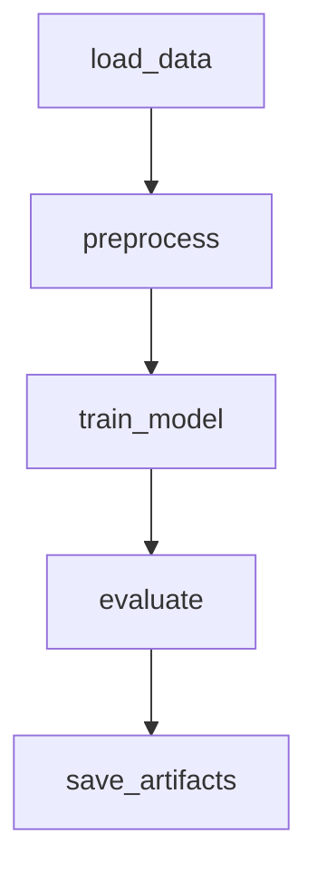

# 🩺 ML Pipeline for Breast Cancer Diagnosis

---

## 📌 Оглавление

- [Описание проекта](#описание-проекта)  
- [Цель проекта](#цель-проекта)  
- [Архитектура пайплайна](#архитектура-пайплайна)  
- [Этапы пайплайна](#этапы-пайплайна)  
- [Запуск проекта](#запуск-проекта)  
- [Интеграция с хранилищем](#интеграция-с-хранилищем)  
- [Анализ отказоустойчивости](#анализ-отказоустойчивости)  
- [Пример метрик](#пример-метрик)  
- [Скриншоты работающего DAG](#скриншоты-работающего-dag)  
- [Идеи для развития](#идеи-для-развития)

---

## 📖 Описание проекта

Данный проект демонстрирует автоматизированный ETL-пайплайн для обучения, оценки и сохранения модели машинного обучения (`LogisticRegression`) на основе датасета Breast Cancer Wisconsin Diagnostic. Все этапы оркестрированы с помощью Apache Airflow, а результаты сохраняются локально или в облачное хранилище.

---

## 🎯 Цель проекта

Создание воспроизводимого, устойчивого пайплайна для диагностики злокачественных опухолей молочной железы с использованием Apache Airflow и Python.

---

## 🏗️ Архитектура пайплайна

## ⚙️ Этапы пайплайна
load_data.py — считывает webc.data, назначает имена колонок из webc.names, сохраняет в results/raw_data.csv.  
preprocess.py — удаляет лишние колонки, нормализует данные, кодирует диагноз, сохраняет в results/preprocessed_data.csv.  
train_model.py — делит данные на train/test, масштабирует, обучает модель LogisticRegression, сохраняет артефакты model.joblib и scaler.joblib.  
evaluate.py — рассчитывает метрики (Accuracy, Precision, Recall, F1), сохраняет в results/metrics.json.  
save_artifacts.py — копирует артефакты и метрики в results_archive/ и (опционально) выгружает их в облачное хранилище.  
Все этапы реализованы как отдельные скрипты, способные запускаться автономно или как задачи в Apache Airflow.  

## 🛠️ Запуск проекта
Установите зависимости:  
pip install -r requirements.txt

Настройте Airflow:  
export AIRFLOW_HOME=$(pwd)/airflow
airflow db init
airflow users create \
    --username admin \
    --firstname Андрей \
    --lastname Родин \
    --role Admin \
    --email example@example.com \
    --password admin
airflow scheduler &
airflow webserver --port 8080

Убедитесь, что в папке sample_data/ лежит файл webc.data.  
Активируйте DAG breast_cancer_pipeline в UI Airflow и запустите выполнение.  
Результаты будут доступны в папке results/ и дублированы в results_archive/.

## ⛅ Интеграция с хранилищем
По умолчанию результаты сохраняются на диск в results/. Дополнительно реализована возможность загрузки артефактов на S3-хранилище (или совместимое).  
Конфигурация подключается через .env файл:  
AWS_ACCESS_KEY_ID=ваш_ключ  
AWS_SECRET_ACCESS_KEY=ваш_секрет  
S3_BUCKET=название_бакета  
Загрузка реализована в save_artifacts.py с помощью boto3. При ошибке доступа — данные сохраняются локально.

## 🚨 Анализ отказоустойчивости
Потенциальная ошибка  
Обработка  
Файл wdbc.data не найден  
Скрипт падает, Airflow повторяет запуск (retries)  
Плохое качество данных, пропуски, outliers  
Применяется очистка и логгирование в preprocess.py  
Ошибка обучения модели  
Исключения обрабатываются, шаг падает корректно  
Ошибка при загрузке на S3  
Артефакты сохраняются локально  
Прерывание пайплайна  
Airflow гарантирует изоляцию задач; используется логгирование, retry

## 📊 Пример метрик
Файл results/metrics.json содержит:  
{  
  "accuracy": 0.9736842105263158,  
  "precision": 0.9761904761904762,  
  "recall": 0.9534883720930233,  
  "f1": 0.9647058823529412  
}

## 💡 Идеи для развития
Добавить MLflow для логирования экспериментов  
Контейнеризация пайплайна через Docker  
Использование Google Cloud Storage или Dropbox API  
Расширение модели до RandomForest, XGBoost  
Мониторинг через Prometheus + Grafana  
Поддержка нотификаций (Slack, Email)  
Покрытие тестами (unit/pytest)  
CI/CD-пайплайн (GitHub Actions)  

Андрей Родин  
17 июня 2025 г.
---
